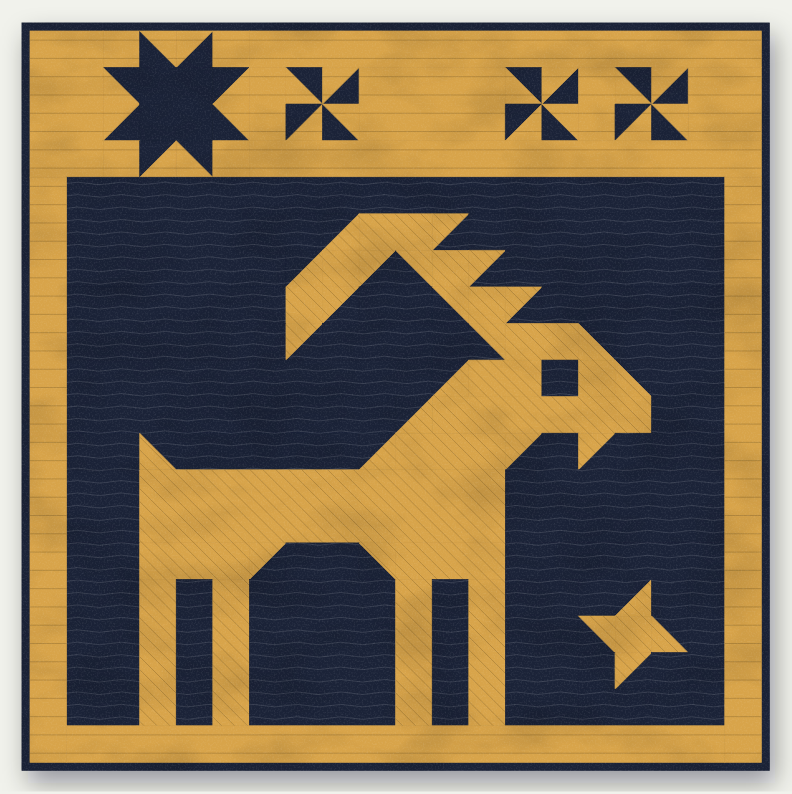
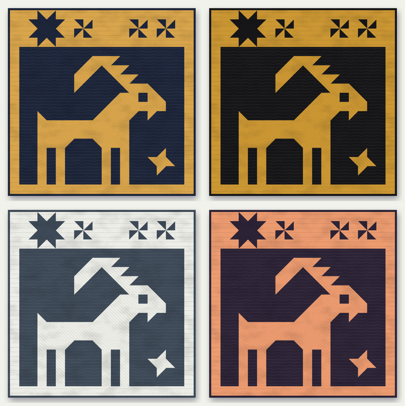

# Steinbock: a Capricorn patchwork wall quilt



An original two-fabric wall quilt made as a companion to the patchwork lion (Leo).
It uses the same visual language: squares, rectangles and half-square triangles on a grid.
An alpine ibex (*Steinbock*, German for both the ibex and the sign of Capricorn) stands in a
night window. Above it, a sky band shows the four brightest stars of the constellation
Capricornus in their real order: Deneb Algedi, Nashira, Dabih and Algedi.

| | |
|---|---|
| Finished size | 100 × 100 cm (40 × 40″) |
| Grid | 20 × 20 units of 5 cm (2″) |
| Pieces | 69 squares and rectangles, 45 half-square triangles |
| Fabric L, light | 1 m (1⅛ yd) |
| Fabric D, dark, incl. binding | 1.3 m (1½ yd) |
| Level | Confident beginner |



## Files

| File | What it is |
|---|---|
| `index.html` | The full pattern. Open it in a browser and switch between cm and inch and between four colourways. |
| `steinbock-pattern-cm.pdf`, `steinbock-pattern-in.pdf` | Printable A4 versions of the pattern (metric and imperial). |
| `design/steinbock.txt` | The design grid that everything else is generated from. |
| `tools/` | The generator: piecing solver, cutting planner, diagrams, page and PDF builder. |
| `VALIDATION.md` | Report of the virtual sewing test (see below). |

The pattern covers materials, a strip-by-strip cutting plan for each fabric, half-square
triangles, the three star blocks, the sky band, the night window in 11 sections (each
with a size check), framing, quilting suggestions, binding, a hanging sleeve and a full
layout chart with every piece code.

## How it is generated

The design is one grid of cells in `design/steinbock.txt`:

```
#  fabric L (light)         .  fabric D (dark)
7 9 1 3  half-square triangle; the digit is the numpad corner that is light
```

`tools/plan.py` turns the grid into a sewing plan:

1. **Piecing.** `tools/quilt.py` searches every way to split each region with straight,
   full-length seams. It keeps the split with the fewest pieces, and then the fewest
   sub-assemblies. The stars and the edelweiss are kept whole as blocks. The night window
   is limited to horizontal sections, so every step reads as "join these left to right".
2. **Piece codes.** Identical cut pieces share a code (L1–L11, D1–D14), numbered by size.
3. **Cutting.** Pieces are packed into strips cut across the width of the fabric (usable
   width 105 cm / 40″). Fabric amounts are the strip total plus a straightening allowance.
4. **Checks.** Every grid cell must be covered exactly once with the right fabric. The
   fabric area must add up, and every planned cut must match the piece list. The build
   stops if any check fails.

## Can it be sewn?

`tools/validate.py` sews the quilt in software, seam by seam, in the order the instructions
give, with real seam allowances. It checks that every join meets edge to edge and that every
size the page tells you to check is right. It then repeats the job 400 times with realistic
cutting and sewing errors, and reports where edges stop matching and where the ibex's outline
would jog across a seam. Results are in [`VALIDATION.md`](VALIDATION.md). In short:

- With exact sewing, all 113 joins meet and all 19 size checks on the page are correct.
- With careful sewing (seam right on average, ±0.5 mm), edges to be joined differ by at most
  9 mm over 91.5 cm, which pins and easing absorb.
- A seam that is consistently 1 mm off is the real risk: busy sections then shrink up to
  18 mm more than plain ones. The pattern therefore starts with a six-square seam test, marks
  the 19 pin points between sections, and cuts the four long strips (D10, L6, L7, L8) 2 cm
  long so you trim them to the measured part.

Software cannot replace a test sew. Before cutting everything, sew the seam test and
sections 10 and 11 (the legs, with the most pin points), and check them against the sizes
in the pattern.

Rebuild after editing the grid:

```sh
python3 tools/build_page.py   # writes index.html
python3 tools/validate.py --md VALIDATION.md
node tools/make_pdf.js        # writes both PDFs (needs Playwright with Chromium)
```

Star positions come from Wolfram StarData.
