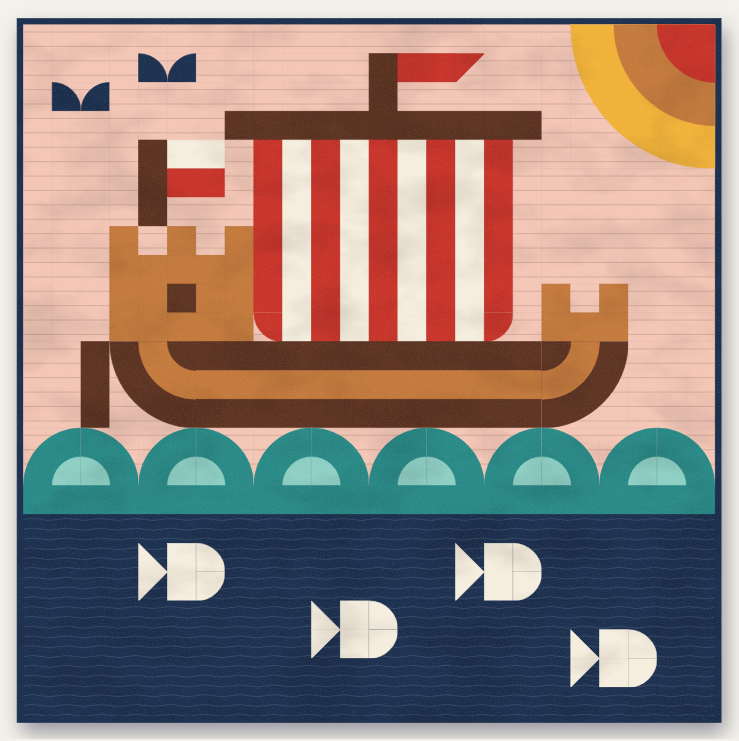
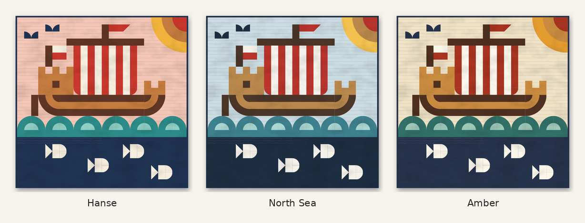

# Kogge: a Hanseatic cog patchwork quilt



An original wall quilt of a *Kogge*, the cog, the merchant ship of the Hanseatic League.
The league of trading towns led by Lübeck ruled trade on the Baltic and the North Sea from the
13th to the 15th century. The best-preserved cog ever found was built around 1380 and raised
from the river Weser at Bremen in 1962. The quilt shows one under a red and white striped sail,
with fore and stern castles, a stern rudder, a Lübeck flag (white over red), gulls, a rising sun,
rolling waves, and herring, the fish that made the Hanse rich.

The drawing is inspired by the modular geometric illustrations of the Icelandic artist
Siggi Eggertsson: every square of a grid holds one simple shape, and quarter circles with
concentric rings turn hard pixels into a round hull, waves and a sun. It is an independent
design and is not affiliated with the artist.

| | |
|---|---|
| Finished size | 120 × 120 cm (48 × 48″) |
| Grid | 24 × 24 units of 5 cm (2″) |
| Pieces | 82 cut pieces, 9 half-square triangles, 29 quarter-circle units |
| Fabrics | 9: sky and navy lengths, smaller cuts for the rest (see below) |
| Techniques | Rotary cutting, half-square triangles, fusible appliqué, straight-seam piecing |
| Level | Intermediate |

| Fabric | Metric | Imperial | Used for |
|---|---|---|---|
| S Sky | 1.1 m | 1¼ yd | Background above the waterline |
| U Sun gold | 1 fat quarter | 1 fat quarter | Sun |
| R Hanse red | 1 fat quarter | ½ yd | Sail stripes, pennant, flag, sun |
| W Sailcloth | 0.4 m | ⅜ yd | Sail stripes, flag, herring |
| C Copper | 0.5 m | ½ yd | Castles, planking, sun |
| B Oak brown | 0.4 m | ½ yd | Hull, mast, yard, rudder |
| T Teal | 0.5 m | ⅝ yd | Waves |
| A Aqua | 1 fat quarter | 1 fat quarter | Wave crests |
| N Baltic navy | 1.2 m | 1⅜ yd | Deep sea, gulls, binding |

Plus fusible web, backing, batting and a hanging sleeve; the pattern lists the sizes.



## Files

| File | What it is |
|---|---|
| `index.html` | The full pattern. Open it in a browser and switch between cm and inch and between three colourways (Hanse, North Sea, Amber). |
| `kogge-pattern-cm.pdf`, `kogge-pattern-in.pdf` | The printable pattern: metric on A4, imperial on US Letter, with bookmarks. Print at 100 %: the templates are true size. |
| `design/kogge.py` | The design: fabrics and the picture, drawn with four modules on the grid. |
| `tools/` | The generator: piecing solver, cutting planner, diagrams, page and PDF builder, validator. |
| `VALIDATION.md` | Report of the virtual sewing test (see below). |

The pattern (version 1.1) covers:

- materials, including backing yardage and how to piece it, and a tools list;
- read-first notes, abbreviations and terms, and a six-square seam test with a tolerance;
- a strip-by-strip cutting plan and piece list for each fabric;
- the triangle units, with how to trim them;
- the quarter-circle units: a tracing list (which template, how many, which fabric) and an
  eight-step fusible appliqué method;
- the top in 7 horizontal sections, with a size to check for every segment, column and
  section, and the pin points and ring ends to match, marked on the diagrams;
- joining, a full quilting plan, binding with diagrams for joining strips and mitring
  corners, and a hanging sleeve;
- five numbered true-size templates with test squares; the two largest print in parts
  that tape together;
- a layout chart with every piece code and a colouring sheet for trying other colours.

## How it is generated

`design/kogge.py` draws the picture on a 24 × 24 grid with four modules:

- **square**: one fabric (`fill`),
- **triangle**: a half-square triangle; the corner digit is the numpad corner of the first fabric (`hst`),
- **quarter circle**: an n × n unit with a quarter disc centred on one of its corners (`qc`),
- **rings**: smaller discs fused on top of a quarter circle, so arcs continue across units
  (the copper plank band bends round the bow and stern this way).

`tools/plan.py` turns the drawing into a sewing plan:

1. **Piecing.** `tools/modular.py` searches every way to split the top with straight,
   full-length seams, keeping quarter-circle units whole. It keeps the split with the fewest
   pieces, then the fewest sub-assemblies, limited to horizontal sections and to pieces that
   fit across the fabric width.
2. **Piece codes.** Identical cut pieces share a code (fabric letter and size number);
   a + marks a piece cut long on purpose and trimmed to fit, so it can't be mixed up with
   its exact twin. Triangle units are H1, H2 and quarter-circle units Q1 to Q6.
3. **Cutting.** Pieces, triangle squares, appliqué backgrounds and appliqué squares are
   packed into strips across the fabric (usable width 105 cm / 40″). Fabric that fits on a
   fat quarter even after prewashing is bought as one.
4. **Checks.** Every grid cell must be covered exactly once with the right fabric, the
   fabric areas must add up and every planned cut must match the piece list. The build
   stops if any check fails.

## Can it be sewn?

`tools/validate.py` sews the top in software, seam by seam, in the order the instructions
give, with real seam allowances and fused quarter circles. It checks that every join meets
edge to edge, that every outline and arc lines up across its seams and that every size the
page tells you to check is right. It then repeats the job 400 times with realistic cutting,
appliqué and sewing errors. Results are in [`VALIDATION.md`](VALIDATION.md). In short:

- Sewn exactly, all 119 joins meet, all 30 outlines that cross a seam line up (10 of them
  arcs), and all 38 size checks on the page are correct, in cm and in inches.
- With careful sewing (seam allowance right on average, ±0.5 mm), the most you ease between
  two pins is under 1 cm over a full section and 6 mm over 37 cm inside one.
- The real risk is a seam that is consistently off: the sky section has many more seams than
  the hull below it, so with every seam 1 mm too wide they differ by almost 3 cm. The pattern
  therefore starts with a six-square seam test (within 2 mm), marks the pin points and the
  arc ends to match, and cuts nine plain pieces 2 cm long so you trim them to the pieced
  part they join.
- Every arc ends square to the seams at its corner, so a wrong seam allowance cannot move
  it. Where an arc only touches a seam, a wrong seam allowance shaves at most 1 mm off it.

Software cannot replace a test sew. Before cutting everything, sew the seam test, one wave
pair (two Q4 units) and the hull section, and check them against the sizes in the pattern.

Rebuild after editing the design:

```sh
python3 tools/build_page.py   # writes index.html
python3 tools/validate.py --md VALIDATION.md
node tools/make_pdf.js        # writes both PDFs (needs Playwright with Chromium)
```
